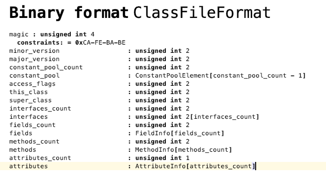
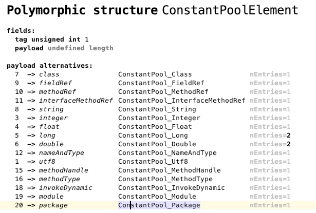
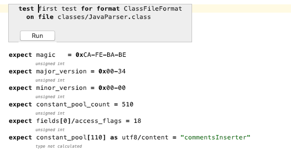

# FormatsDSL

 

A DSL to describe formats and generate loaders

## Define binary formats

This project includes a DSL to define binary formats. For example, this is how we can define the JVM classfile format

It supportes polymorphic structure. These structures have a different format depending on the value of a tag field

## Defining tests

You can also test your format against a specific file, to ensure it is loaded correctly

